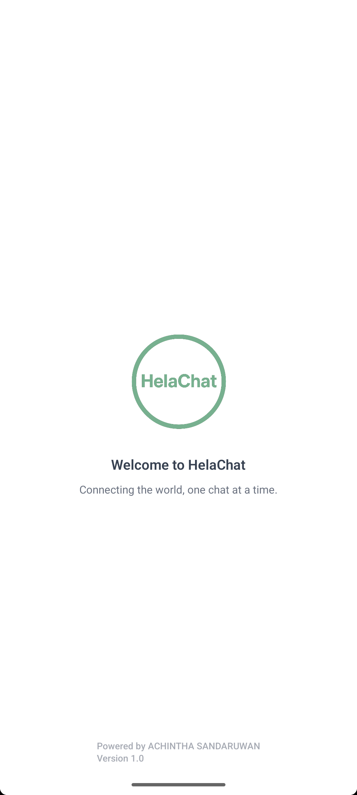

<!--
  Enhanced README for HelaChat
  - Decorative icons, improved layout, real screenshots section
  - All images referenced from /assets as per your supplied list
-->

<div align="center">
  
  <h1 align="center">🌐 HelaChat</h1>
  <p align="center">
    <b>A modern mobile-first messaging app built with Expo (React Native) and a Java + Hibernate backend.</b>
  </p>

  <!-- Badges -->
  <p align="center">
    <a href="https://github.com/Achintha-999/helachat">
      
    </a>
    <a href="https://github.com/Achintha-999/helachat/commits/main">
      
    </a>
    <a href="https://github.com/Achintha-999/helachat">
      
    </a>
    <a href="https://github.com/Achintha-999/helachat/blob/main/LICENSE">
      
    </a>
  </p>
</div>

---

## 🚀 Quick links

- 💻 Repo: https://github.com/Achintha-999/helachat
- 👤 Maintainer: [Achintha-999](https://github.com/Achintha-999)
- 📬 Contact: Open an issue or PR on GitHub

---

## 📚 Table of contents

- [About](#about)
- [Status & Features](#status--features)
- [Tech stack](#tech-stack)
- [📸 Screenshots](#screenshots)
- [Requirements](#requirements)
- [Quickstart](#quickstart)
  - [Frontend (Expo) — run locally](#frontend-expo---run-locally)
  - [Backend (Java + Hibernate) — run locally](#backend-java--hibernate---run-locally)
- [Configuration / Environment](#configuration--environment)
- [Ngrok — exposing backend for mobile testing](#ngrok---exposing-backend-for-mobile-testing)
- [Hibernate configuration example](#hibernate-configuration-example)
- [Project structure (high-level)](#project-structure-high-level)
- [How it works (overview)](#how-it-works-overview)
- [Testing](#testing)
- [Contributing](#contributing)
- [Roadmap / Future enhancements](#roadmap--future-enhancements)
- [License & contact](#license--contact)

---

## 📝 About

HelaChat is a mobile-first, real-time messaging client (React Native + Expo) that connects to a Java servlet/Hibernate backend for user management, message persistence and real-time events. The aim is a polished UI with lightweight, extensible architecture for chat features.

---

## 🔥 Status & Features

🌱 <b>Current status:</b> <i>In development</i>

**Key features:**
- 👤 User registration & authentication
- 🖼️ Profile image selection (upload or avatar picker)
- 🎨 Theme customization (light/dark)
- 💬 Conversations list and single-chat UI
- 🔄 Real-time messaging via WebSocket / socket server
- 🗄️ Message persistence (relational DB via Hibernate)

---

## 🛠 Tech stack

- **Frontend:** Expo / React Native, TypeScript, React Navigation, NativeWind (Tailwind), AsyncStorage
- **Backend:** Java Servlets, Hibernate ORM (MySQL/Postgres), WebSocket
- **Dev tooling:** Ngrok (optional), Expo CLI, Maven/Gradle (backend builds)

Languages in repo: TypeScript, Java, Other

---

## 📸 Screenshots

<div align="center" style="display:flex; flex-wrap:wrap; gap:16px;">

  
  
  
  
  
  
  

</div>

---

## ⚙️ Requirements

- 🟩 Node.js (v14+), npm/yarn
- 📱 Expo CLI: `npm i -g expo-cli`
- ☕ Java JDK 8+ (backend)
- 🏗️ Tomcat / GlassFish (or any Servlet container) or embedded runner
- 🗄️ MySQL or PostgreSQL (database)
- 🌍 Ngrok (optional — for remote device testing)

---

## ⚡ Quickstart

A short path to get you running locally.

### 📲 Frontend (Expo) — run locally

1. Clone and install:
   ```bash
   git clone https://github.com/Achintha-999/helachat.git
   cd helachat
   npm install
   # or
   yarn install
   ```

2. Configure environment (see [Configuration / Environment](#configuration--environment)).

3. Start Expo:
   ```bash
   expo start
   ```
   - Scan the QR code with Expo Go on a physical device, or open the iOS/Android simulator.
   - Set `EXPO_PUBLIC_API_URL` and `EXPO_PUBLIC_WS_URL` in your `.env` as needed.

---

### 🖥️ Backend (Java + Hibernate) — run locally

1. Open the backend module in your IDE (IntelliJ / Eclipse).
2. Ensure your DB (MySQL/Postgres) is running and create the schema/database `helachat`.
3. Update `hibernate.cfg.xml` (see example below).
4. Build and deploy the WAR to your Servlet container, or run with your preferred launcher.
5. Verify REST endpoints, such as: http://localhost:8080/helachat/api/auth/register

---

## 🔐 Configuration / Environment

Frontend expects environment variables prefixed with `EXPO_PUBLIC_`.

Example `.env`:
```text
EXPO_PUBLIC_API_URL=http://localhost:8080/helachat/api
EXPO_PUBLIC_WS_URL=ws://10.0.2.2:8080/helachat/ws
EXPO_PUBLIC_APP_NAME=HelaChat
EXPO_PUBLIC_ENV=development
```

---

## 🌐 Ngrok — exposing backend for mobile testing

1. Install ngrok:
```bash
npm install -g ngrok
```
2. Start it pointing to your backend server port:
```bash
ngrok http 8080
```
3. Use the public HTTPS URL printed by ngrok and set env variables:
```text
EXPO_PUBLIC_API_URL=https://1234abcd.ngrok.io/helachat/api
EXPO_PUBLIC_WS_URL=wss://1234abcd.ngrok.io/helachat/ws
```

Restart Expo when you change env variables.

---

## 🧾 Hibernate configuration example

Add to your backend's `hibernate.cfg.xml` (update values accordingly):

```xml
<?xml version='1.0' encoding='utf-8'?>
<hibernate-configuration>
  <session-factory>
    <!-- Database connection settings -->
    <property name="hibernate.connection.driver_class">com.mysql.cj.jdbc.Driver</property>
    <property name="hibernate.connection.url">jdbc:mysql://localhost:3306/helachat?serverTimezone=UTC</property>
    <property name="hibernate.connection.username">your_username</property>
    <property name="hibernate.connection.password">your_password</property>
    <!-- SQL dialect -->
    <property name="hibernate.dialect">org.hibernate.dialect.MySQL8Dialect</property>
    <!-- Show SQL for debugging -->
    <property name="hibernate.show_sql">true</property>
    <!-- Auto schema update (dev only) -->
    <property name="hibernate.hbm2ddl.auto">update</property>
    <!-- Mapped classes -->
    <!-- <mapping class="com.yourcompany.helachat.model.User"/> -->
  </session-factory>
</hibernate-configuration>
```

> ⚠️ For production, use `validate` or manage schema migrations with Flyway/Liquibase — do **not** use `update` in production.

---

## 📁 Project structure (high-level)

```
HelaChat/
├── App.tsx                # Expo entry point (frontend)
├── assets/                # images, icons, splash, screenshots
├── src/                   # frontend source (screens, components, api, socket)
├── backend/               # (optional) Java servlet/Hibernate backend
│   ├── src/
│   └── hibernate.cfg.xml
├── app.json               # Expo config
├── package.json
└── README.md
```

---

## 🔎 How it works (overview)

**Frontend:**
- Expo app connects to backend REST API for auth and history.
- For real-time messaging, the app establishes a WebSocket connection and listens for message events.
- Local persistence uses AsyncStorage for caching user/session data.

**Backend:**
- Java servlets expose REST endpoints for authentication, user/profile management and message history.
- A WebSocket server handles real-time message broadcasting and room management.
- Hibernate maps entities (User, Chat, Message) to the relational DB.

---

## ✅ Testing

- **Frontend:**  
  - Unit: `npm run test` (if tests exist)  
  - Lint: `npm run lint`
- **Backend:**  
  - Run JUnit or integration tests via Maven/Gradle

---

## 🤝 Contributing

Thanks for wanting to contribute! Suggested workflow:
1. Fork the repo
2. Create a branch: `feature/<name>` or `fix/<issue>`
3. Run lint & tests locally
4. Open a Pull Request with a clear description, screenshots, and a test plan

---

## 📅 Roadmap / Future enhancements

- 👥 Group chats
- 🖼️ Media sharing (images, video)
- 🔔 Push notifications
- 📶 Improved offline support and message queueing
- 🌓 Dark mode polish and theme persistence

---

## 📝 License & contact

This project is open-source. See LICENSE for details (e.g., MIT).

Maintainer: Achintha-999 — https://github.com/Achintha-999

---
```
